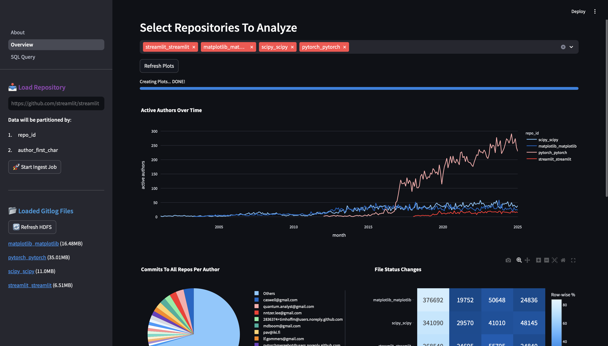
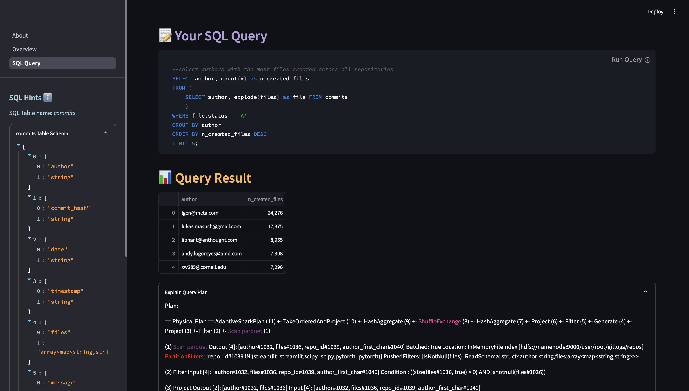
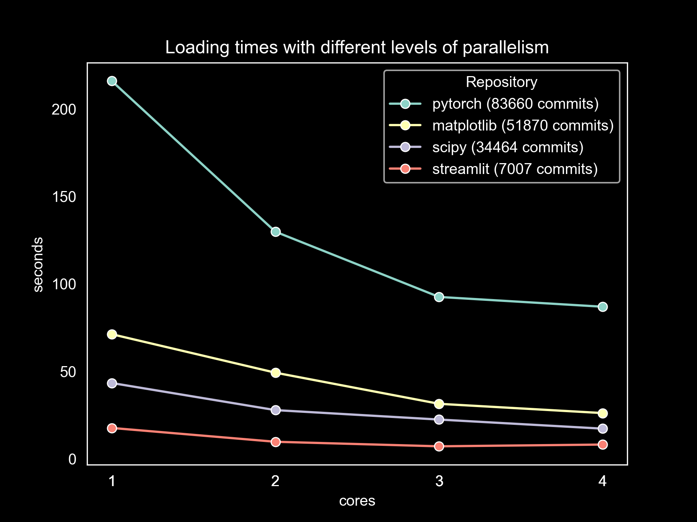

# GitQuery



## About
This tool allows users to compare statistics about repositories and query
data about contributors across repositories. 
You can ingest git repositories and make 
queries like **"Who deleted the most files in all repositories?"**
or **"Which users contributed to all repositories in a given list?"**.
Data is uploaded to HDFS and queries are made with Spark, all containerized with Docker.

## Features
- Ingest git metadata to HDFS about any repository
- See summarized overview about the loaded repositories on auto-generated graphs
- Query Spark dataframe with the provided SQL interface
- See how Spark executes queries. Some important Spark operations are highlighted 
in the query plan, such as pushed partition filters or shuffles


*SQL query interface with query execution plan*


## Quickstart

```
docker compose up [--scale spark-worker=2]
//start queries on http://localhost:8501
```  
This will launch 
- HDFS containers
  - datanode
  - namenode with UI on [http://localhost:9870](http://localhost:9870)
- Spark containers
  - Spark Master with UI on [http://localhost:8080](http://localhost:8080)
  - Spark workers
    - scaled with the command above
    - each has two executors and 2GB memory
- The streamlit app to 
  - interact on [http://localhost:8501](http://localhost:8501)
  - see the spark driver UI on [http://localhost:4040](http://localhost:4040) when a job is running
- A jupyter notebook environment in the docker network for free interaction on
[http://localhost:8888](http://localhost:8888)

## How it works

### Ingest
To get the data, the User has to give a git repository URL and press ingest.
Once cloned, a gitlog file is generated and uploaded to HDFS.
After this Spark (with the app running the driver code) will read
the file and parse it to a dataframe containing information
about file changes, author, date, repository etc.
The RDD is then written back to HDFS in parquet partitioned by repository ID


*A local benchmark about how additional cores speed up ingest times of bigger repositories*
### Querying

Querying involves reading the ingested git metadata with Spark
and running queries on the RDD. 
The results are then visualized on the app with streamlit.


A few graphs are auto-generated, but in the streamlit application, a SQL interface is
also provided to interact with spark directly. You can run your own SQL commands
on the Spark RDD and see the result dataframe directly on the app. Additionally,
you can take a look at the spark query plan, with some operations highlighted,
such as utilized partition filtering when reading ocker copthe dataset for the query.


## Troubleshooting
- **Py4JNetworkError: Answer from Java side is empty**: 
When ingesting big repositories (several tens of thousands of commits), 
try increasing the spark-worker memory parameter in the docker-compose file, 
Spark might have run out of memory
- **Git repository does not exist**:
If the repository is private you can try logging in with your git credentials
in the streamlit docker container, this container is responsible for cloning.
