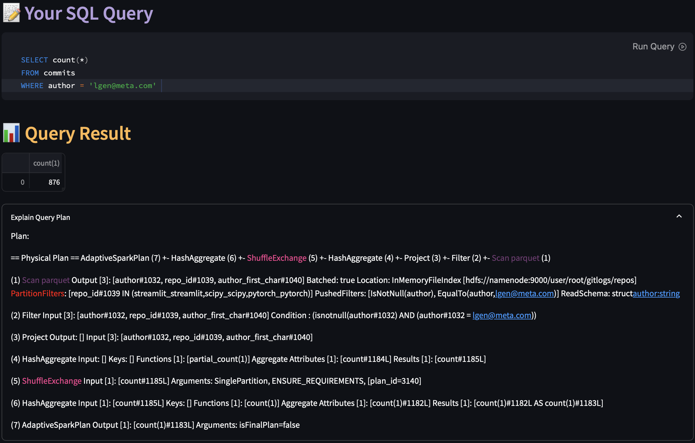
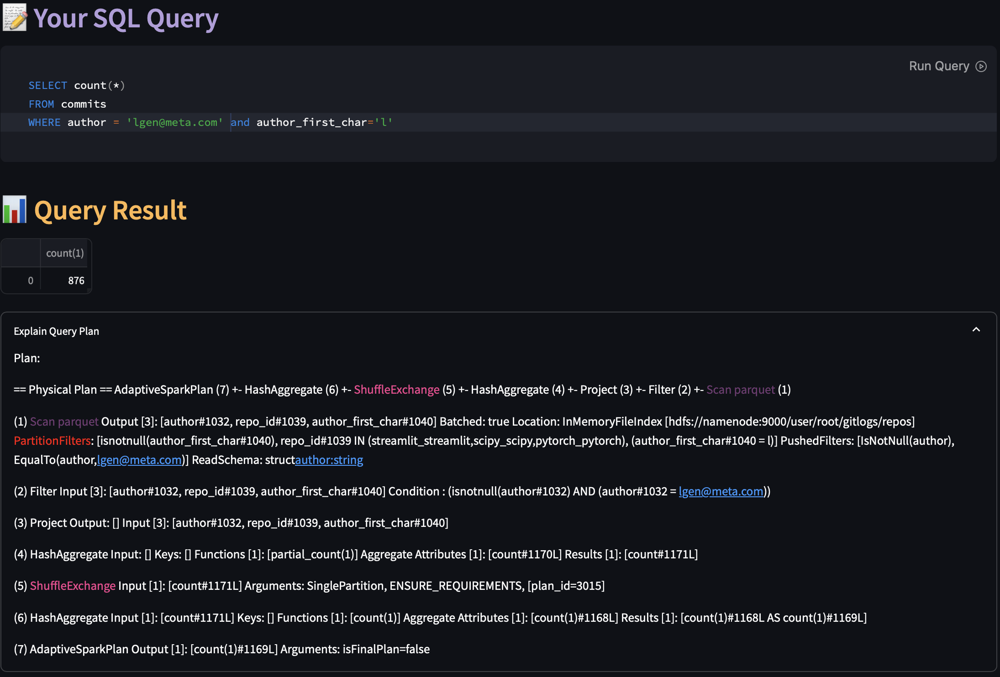

# GitQuery

<p align="center">
  
</p>

## About
This tool allows users to compare statistics about repositories and make aggregations
across all of them. 
You can ingest git repositories and make 
queries like **"Who deleted the most files in all repositories?"**
or **"Which users contributed to a given subset of repositories?"**.
Data is uploaded to HDFS and queries are made with Spark, all containerized with Docker.

## Features
- Ingest git metadata to HDFS about any repository
- See summarized overview about the loaded repositories on auto-generated graphs
- Query Spark dataframe with the provided SQL interface
- See how Spark executes queries. Some important Spark operations are highlighted 
in the query plan, such as pushed partition filters or shuffles

>
*SQL query interface with query execution plan*


## Quickstart

```
git clone https://github.com/Sneccello/GitQuery.git
cd GitQuery
docker compose up [--scale spark-worker=2]
#start queries on http://localhost:8501
```  
This will launch 
- HDFS containers
  - datanode
  - namenode with UI on [http://localhost:9870](http://localhost:9870)
- Spark containers
  - Spark Master with UI on [http://localhost:8080](http://localhost:8080)
  - Spark workers
    - scaled with the command above
    - each has two executors and 2GB memory
- The streamlit app
  - interact on [http://localhost:8501](http://localhost:8501)
  - see the spark driver UI on [http://localhost:4040](http://localhost:4040) when a job is running
- A jupyter notebook 
  - [http://localhost:8888](http://localhost:8888)
  - To experiment with Spark and HDFS


## How it works

### Ingest
To get the data, the User has to give a git repository URL and press ingest.
Once cloned, a gitlog file is generated and uploaded to HDFS.
After this Spark (with the app running the driver code) will read
the file and parse it to a dataframe containing information
about file changes, author, date, repository etc.
The RDD (Resilient Distributed Dataset) is then written back to HDFS in parquet. 
The data is partitioned over the repository
name (repo_id) and also the first character of the authors' emails to serve as a sparse
index for queries (examples under **Querying**)
>
*The ingest workflow of the app*


>
*A local benchmark about how additional cores speed up ingest 
times of bigger repositories exploiting Spark's parallelism*
### Querying

Querying involves reading the ingested git metadata with Spark
and running queries on the RDD.
>
*How plots are generated in the Overview page*


Apart from the auto-generated graphs, an SQL interface is
also provided to interact with the RDDs more freely. You can run your own SQL commands
on the Spark RDD and see the result dataframe directly on the app. Additionally,
you can take a look at the spark query plan, with some operations highlighted as seen below.
#### Partition Filter Example
> 
*We can see that in this query Spark does not use the author_first_char
partition filter and thus reading all files from HDFS*


> 
*If We add the author_first_char filter explicitly in the SQL query
Spark will pick it up and use it as a partitionFilter, reading only a relevant
subsets of the HDFS files*


## Troubleshooting
- **Py4JNetworkError: Answer from Java side is empty**: 
When ingesting big repositories (several tens of thousands of commits), 
try increasing the spark-worker memory parameter in the docker-compose file, 
Spark might have run out of memory
- **Cannot access Jupyter notebook on [http://localhost:8888](http://localhost:8888) 
it requires a password**: You can run the following command to see the token
that you have to paste on the UI
  ```docker exec jupyter jupyter notebook list```
- **Git repository does not exist**:
If the repository is private you can try logging in with your git credentials
in the streamlit docker container with ```docker exec```, this container is responsible for cloning.
