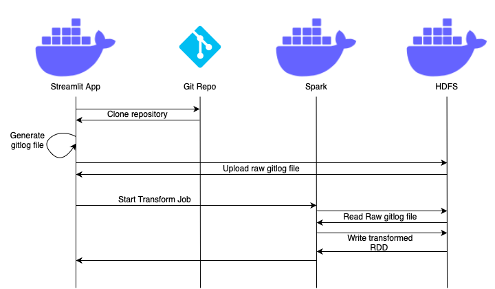

# RepoCompare

## About
This tool allows users to compare statistics about repositories
and their contributors. You can ingest any git repository and make 
queries like "Who created the most files in all repositories"
or "Which person committed the most to all repositories in a given timespan".
Data is uploaded to HDFS and queries are made with Spark, all containerized with Docker.

## Quickstart

```
docker compose up
```
This will launch all docker containers for HDFS and Spark as well as for the streamlit app.
**You can interact with the app on the streamlit default port 8501**.
Additionally, a Jupyter environment is also exposed on port 8888 for 
free interaction with HDFS and Spark.

## How it works

To get the data, the user has to give a git repository URL.
Once cloned, a gitlog file is generated and uploaded to HDFS.
After this Spark (with the app running the driver code) will read
the file and parse it to a dataframe containing information
about file changes, author, date, repository etc.
The RDD is then written back to HDFS next to the other repositories.



Querying involves reading the ingested git metadata with Spark
and running queries on the RDD.  The results are then visualized on the app.


